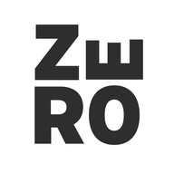
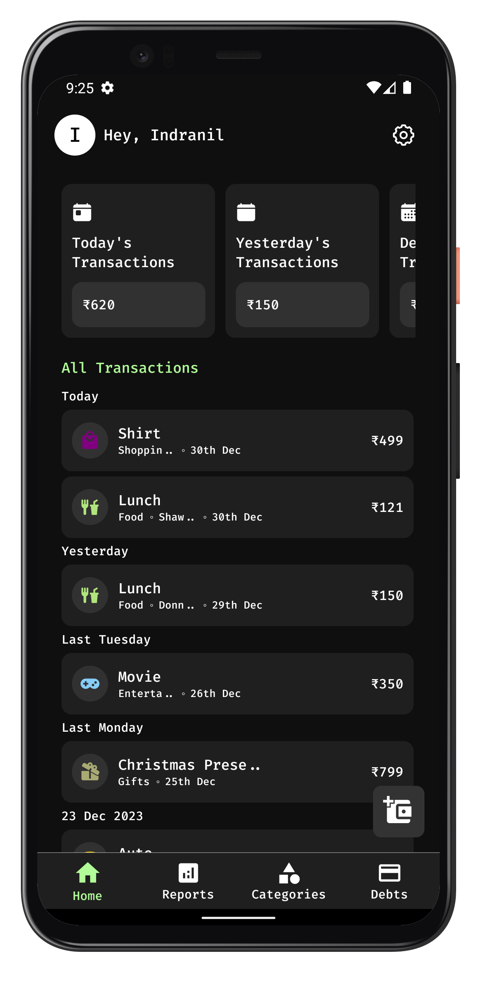
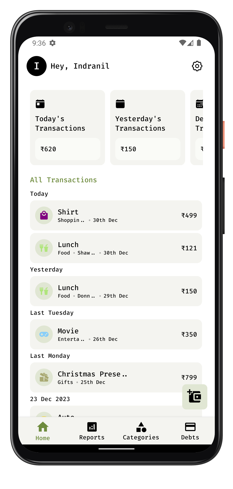
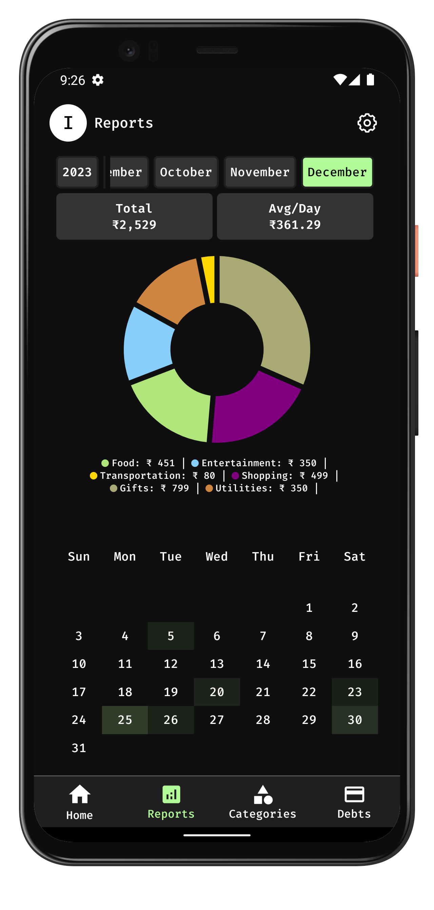
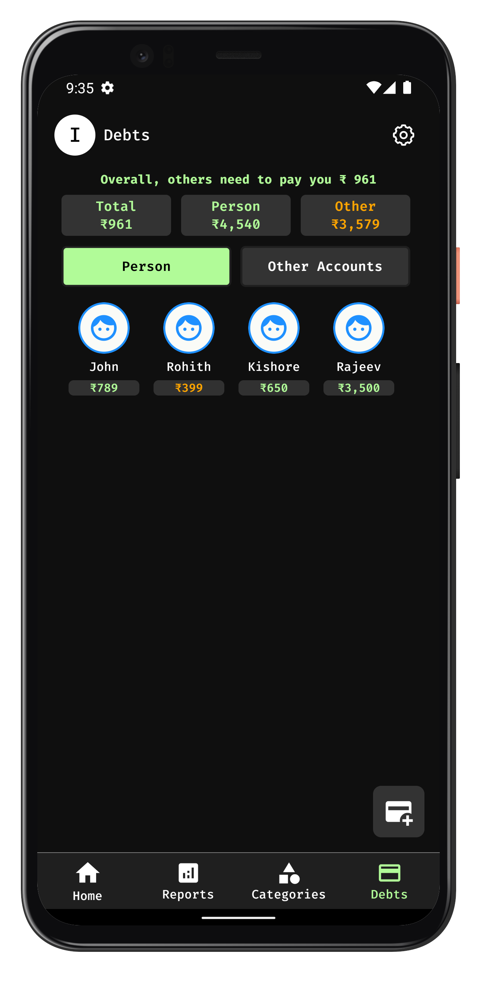
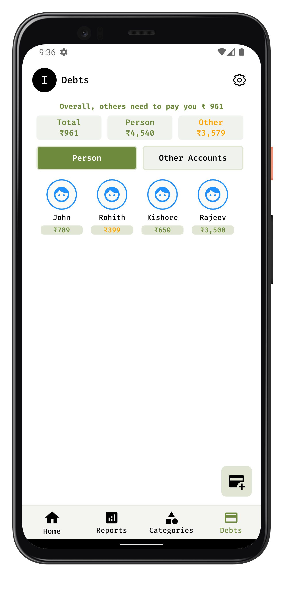
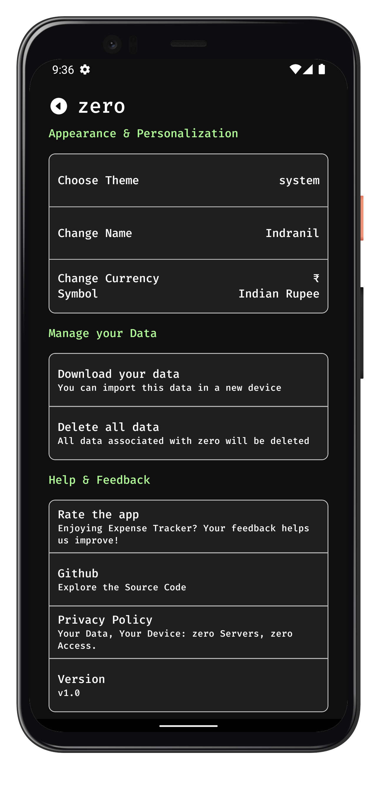
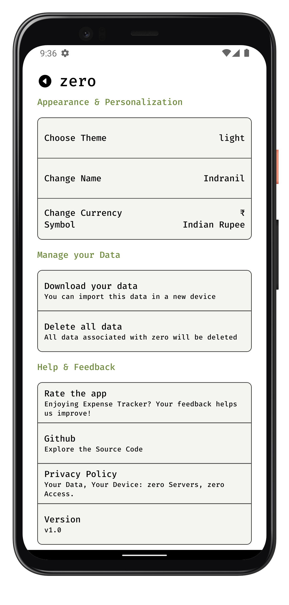
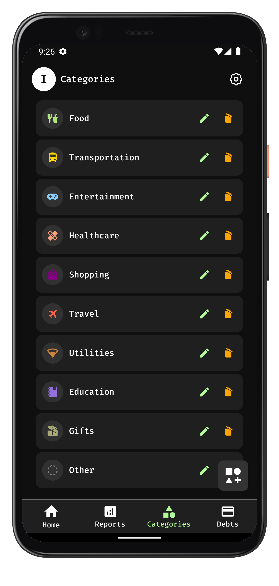
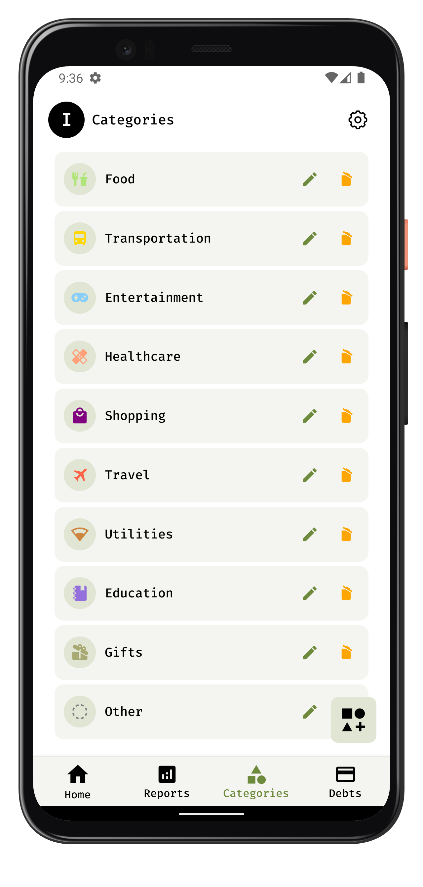

<div align="center">
    
    <h1 align="center">zer0 - Minimal Expense Manager</h1>
</div>

Zero is a lightweight, open-source Android application designed to empower users to effortlessly manage their expenses while prioritizing privacy. With a minimalistic user interface, dark and light themes, and a commitment to keeping user data entirely on their devices, Zero ensures a seamless and secure expense tracking experience.

## Screen Shots

<div style="display: flex; flex-direction: row; flex-wrap: wrap;">










</div>

## Features

### 1. Account Creation

- **New User:** Easily create a local account by choosing a username, default categories, and currency symbol.

- **Existing User:** Upload the `zero***.json` file to sync user data and continue using the application seamlessly.

### 2. Expense Tracking

- **Add, Edit, Delete:** Effortlessly manage expenses by adding, editing, or deleting transactions along with customizable categories.

### 3. Category Modification

- **Add, Delete, Edit:** Tailor the application to your needs by modifying expense categories.

### 4. View Insights

- **Analytics:** Gain valuable insights into spending habits with features like average per day, total spending by each day, and monthly overviews.

- **Heatmap:** Visualize spending patterns with a heatmap, providing a comprehensive overview of monthly expenditures.

### 5. Borrowings or Lendings

- **Debtor Management:** Track borrowings or lendings by creating debtors and managing debts with a user-friendly interface.

### 6. Settings

- **Customization:** Personalize the application by changing currency symbols, themes, and usernames.

- **Export/Import Data:** Easily export or import all application data in JSON format for backup or migration purposes.

- **Delete Data:** Maintain control over your data with the option to delete all application data.

### 7. Privacy

- **Local Database:** User data is stored securely on the device, ensuring privacy is prioritized.

- **No Data Collection:** Zero collects no user data, not even usernames, fostering a commitment to user privacy.

## Folder Structure

The project's folder structure is organized as follows:

- `src/` - Contains the source code for the zer0 app.
  - `components/` - React Native components used throughout the app.
  - `screens/` - React Native screens.
    - index.tsx - Main React component file for the screen, responsible for rendering the UI.
    - useScreenName.ts - Custom hook for storing business logic specific to the screen named "ScreenName".
    - style.ts - Styles specific to the "ScreenName" screen, maintaining separation of concerns.
  - `hooks/` - React Global hooks defined here.
  - `redux/` - Redux store configuration and slices.
  - `schemas/` - Realm database schemas defined here.
  - `services/` - Static assets such as images and fonts.
  - `navigation/` - Navigation configurations.
  - `utils/` - Utility functions and helpers.
  - `styles` - Global stylesheet defined here.
  - `android/` - Android-specific project files and configurations.
  - `ios/` - iOS-specific project files and configurations.
- `assets` - All assets for the project is stored here
  - `fonts` - Store font files such as .ttf or .otf here.
  - `images` - Store image assets such as PNGs, JPGs, etc., here.
  - `jsons` - Store JSON data files here, which may be used for configuration or other structured data.

## Getting Started with the code

To use zer0, simply download the app from the playstore and use it.

OR

Follow these steps to run the FoodTechApp project locally:

1. Download and install Node.js from the official website: [Node.js Download](https://nodejs.org/en/download/)

2. Open a terminal window on your machine.

3. Navigate to the directory where you want to store the project.

4. Run the command:

   ```shell
   git clone https://github.com/indranilbhuin/zero.git
   ```

5. Wait for Git to clone the repository to your machine.

6. Once the cloning process is complete, navigate to the project's root directory:

   ```shell
   cd zero
   ```

7. Run the command to install all required dependencies:

   ```shell
   yarn install
   ```

8. Make sure you have a simulator or a device set up for running the app. You can use Android Studio or Xcode to set up an emulator or connect a physical device.
